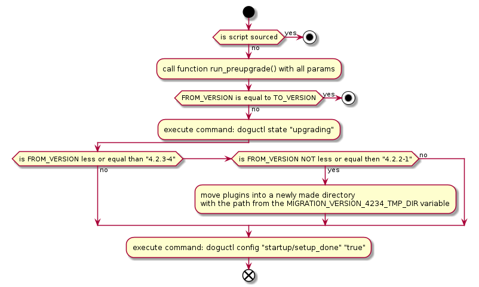
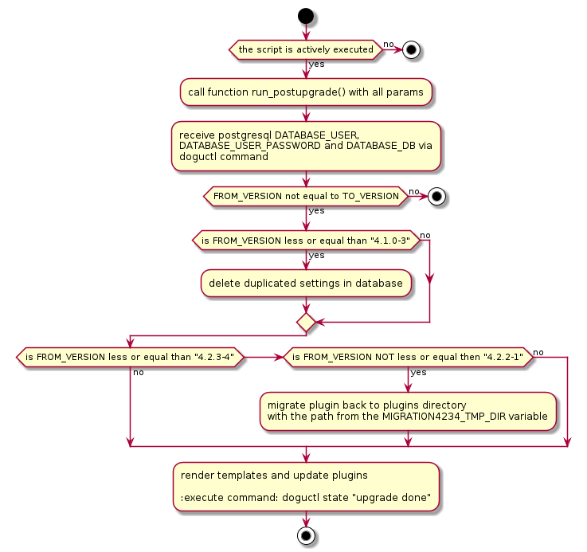

# Upgrade des Redmine-Dogus

Bei der Weiterentwicklung des Redmine-Dogus muss eben berücksichtigt werden, dass ältere Versionen auf die neue Version 
aktualisiert werden können. Dies wird über ein Skript vor dem Upgrade `pre-upgrade.sh` und ein Skript nach dem Upgrade 
`post-upgrade.sh` sichergestellt.

## Allgemeiner Ablauf

Bei einem Dogu-Upgrade wird zuerst das Preupgrade-Skript der neuen Version im alten Dogu ausgeführt, um nötige Datensicherungen 
durchzuführen.
Im Anschluss wird die neue Version installiert und das Postupgrade-Skript ausgeführt.

### Preupgrade-Ablauf

### Postupgrade-Ablauf

