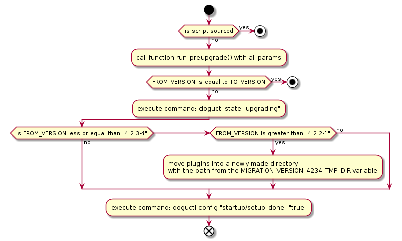
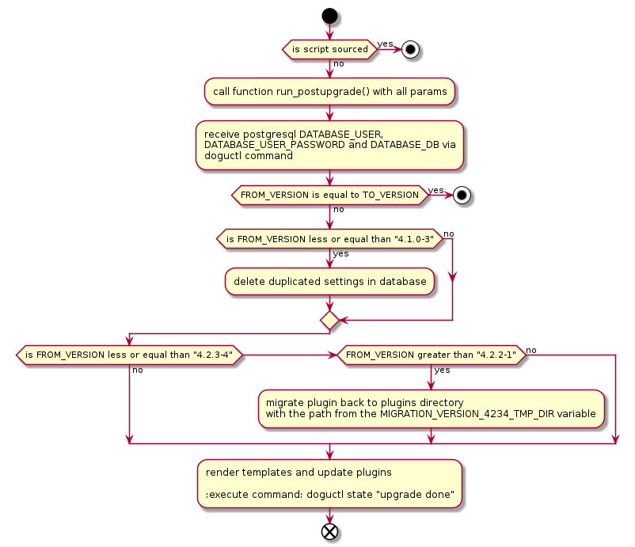

# Upgrade of the Redmine Dogu

During the further development of the Redmine Dogu you need to take into account the ability to upgrade older versions 
of the Redmine Dogu to the new version. Before the upgrade the script `pre-upgrade.sh` prepares the old Dogu version and
afterwards the script `post-upgrade.sh` finishes the upgrade steps.

## Common Process

The pre upgrade script prepares the old Dogu version including backups of data followed by the post upgrade script which
restores data and finishes the process.

### Pre upgrade process

### Post upgrade process

