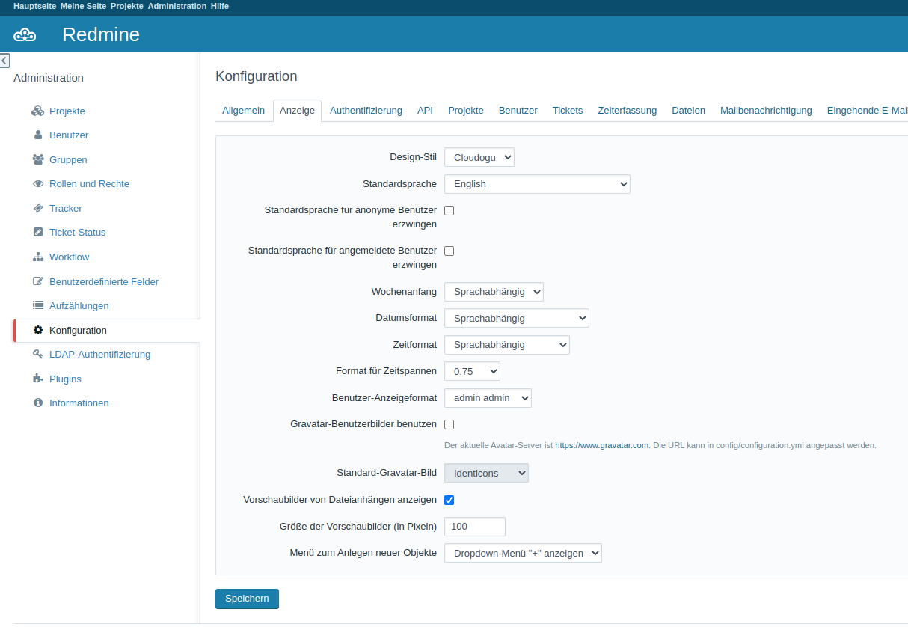

# Änderung der Gravatar-Einstellungen
Redmine verwendet Gravatar, um Bilder der Nutzenden anzuzeigen. Dies kann in den Einstellungen deaktiviert werden.

## Über die Oberfläche
* Besuchen Sie `https://<fqdn>/redmine/settings?tab=display`
* Deaktivieren Sie dort die Checkbox `Gravatar-Benutzerbilder benutzen`
* Klicken Sie auf speichern

## Über die Registry
* Setzen Sie den registry-Key `config/redmine/default_data/new_configuration` auf den Wert `{settings:{gravatar_enabled:0}}` und starten Sie das Dogu neu
* Die Konfiguration wird nun automatisch angepasst

