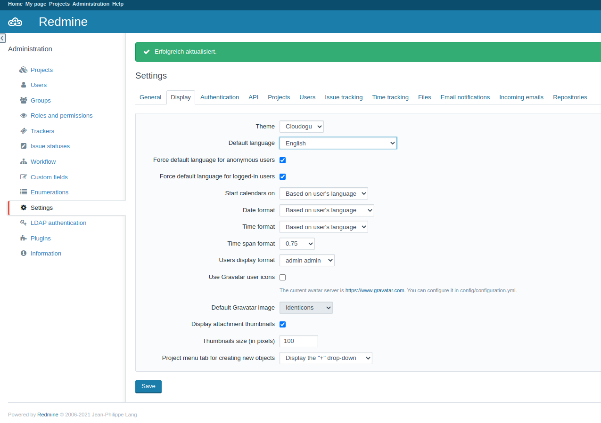

# Changing Gravatar settings
Redmine uses Gravatar to display images of the users. This can be disabled in the settings.

## About the interface
* Visit `https://<fqdn>/redmine/settings?tab=display`
* Uncheck the `Use gravatar user images` checkbox there.
* Click on save

## About the registry
* Set the registry key `config/redmine/default_data/new_configuration` to the value `{settings:{gravatar_enabled:0}}` and restart the Dogu
* The configuration will now be adjusted automatically