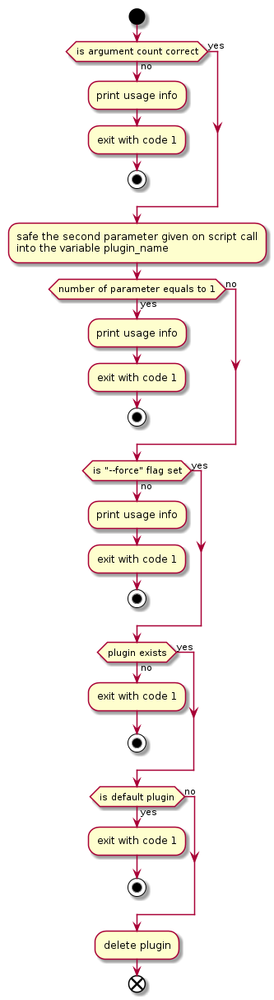

# Dateiverwaltung von Redmine-Plugins

Redmine lässt sich mit Plugins erweitern. Dabei ist die Verwaltung auf Dateiebene einfach. 

## Neue Plugins hinzufügen

Neue Plugins müssen als Verzeichnis im `plugins`-Volume des Redmine-Dogus abgelegt werden. Der Pfad lautet 

```
/var/lib/ces/redmine/volumes/plugins
```

Beispielhafte Verzeichnisansicht anhand des CAS-Plugins:

```
/var/lib/ces/redmine/volumes/plugins
├─ redmine_cas/
   ├─ app
      ├─ ...
   ├─ config
      ├─ ...
   ├─ lib
      ├─ ...
   ├─ Gemfile
   ├─ init.rb
```

Um ein neues Plugin hinzuzufügen, muss das Verzeichnis des neuen Plugins in das Verzeichnis `/var/lib/ces/redmine/volumes/plugins` kopiert werden. Beim nächsten Dogu-Neustart wird das Plugin installiert und kann verwendet werden.

### Ruby Gem und eine Internetverbindung

Neue Plugins benötigen sehr wahrscheinlich weitere Gem-Abhängigkeiten. In der Regel werden diese über https://rubygems.org ausgeliefert. 

In Cloudogu EcoSystem-Instanzen ohne Internetzugang ist dieser Schritt daher **nicht ohne weiteres möglich**. Eine Lösungsmöglichkeit wäre das Kopieren der Abhängigkeiten in den Ruby-Gem-Cache innerhalb des Containers mit `docker cp` udgl. Aktuell liegt der Cache unter `/usr/lib/ruby/gems/2.7.0`, dies kann sich jedoch in weiteren Versionen ändern. `docker exec redmine gem environment` liefert hierzu weitere Informationen.

Für im Dogu mitgelieferte Plugins ist keine Internetverbindung nötig, da die Abhängigkeiten während der Image-Erstellung bereits installiert wurden. Dies ist auch der Grund, warum die Plugins im Image sowohl unter `${WORKDIR}/plugins` als auch unter `${WORKDIR}/defaultPlugins` liegen. 

## Plugins entfernen

Das Redmine-Dogu liefert einen Befehl zum Löschen von bereits installierten Plugins, welcher von Außen über die `cesapp` aufrufbar ist. Da durch das Entfernen des Plugins ggf. auch Änderungen an der Datenbank durchgeführt werden, wird ein Backup der
Datenbank vor dem Entfernen des Plugins empfohlen.

Mit dem Befehl 

```
cesapp command redmine delete-plugin <plugin name> --force
```

wird das Plugin `<plugin name>` aus Redmine komplett entfernt. Nach der erfolgreichen Ausführung des Befehls muss das Dogu einmal neugestartet werden, damit auch Redmine die geladenen Plugins aktualisiert. Andernfalls kann es zu schwerem Fehlverhalten in Redmine kommen.

Die mit dem Docker-Image gelieferten Standard-Plugin, die für den Betrieb des Dogus notwendig sein, werden bei jedem Neustart wiederhergestellt:
- redmine_cas
- redmine_extended_rest_api
- redmine_activerecord_session_store

